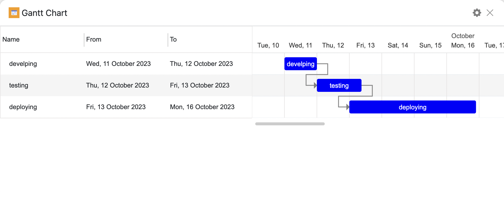

# SeaTable Gantt Chart Plugin

The SeaTable Gantt Chart plugin allows you to enhance your SeaTable tables with interactive Gantt charts for project management and scheduling. This plugin is written in JavaScript and can be easily added to your SeaTable tables.



## Plugin Directory Structure

```
gantt-chart-plugin
├── app.js                          // Compiled JavaScript file
├── setting.local.js                // Plugin api credentials
├── components                      // Plugin components folder
│   ├── ganttchart.js               // Main component of the plugin
│   └── gantt-setting.js            // Plugin settings component

```

The `info.json` file contains plugin metadata, including the name, version, display type, display name, description, and information about included files.

## Plugin Features

- **Interactive Gantt Charts**: Visualize project timelines and task dependencies.
- **Customizable Display**: Configure the Gantt chart's appearance to suit your needs.
- **Seamless Integration**: Easily integrate the Gantt chart into your SeaTable workspace.
- **Local Development**: Develop and test the plugin locally with sample data.

## Getting Started

Follow these steps to start using the SeaTable Gantt Chart plugin:

1. **Clone the Project**: Clone the Gantt Chart plugin project to your local machine.


2. **Configure Plugin Development (Local)**: Copy the `setting.local.dist.js` file and create a `setting.local.js` file. Customize the configuration in `setting.local.js` to access your SeaTable data during local development.

3. **Start Development**:


    - Run `npm install` to install plugin dependencies.
    - Run `npm run start` to launch the local development environment.
    - Test your plugin with sample data.
    - Use SeaTable's `dtable-sdk` to interact with your tables and build the Gantt chart functionality in the `App.js` file.

4. **Build and Upload the Plugin**:

    - Run `npm run build-plugin` to package the plugin.
    - Upload the plugin to your SeaTable workspace for production use.

Now you have successfully developed and deployed the SeaTable Gantt Chart plugin to enhance your project management capabilities.
